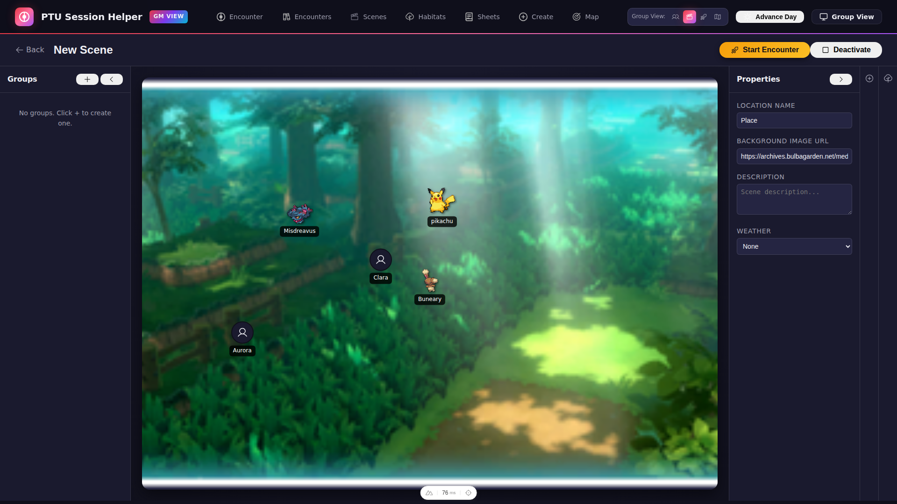
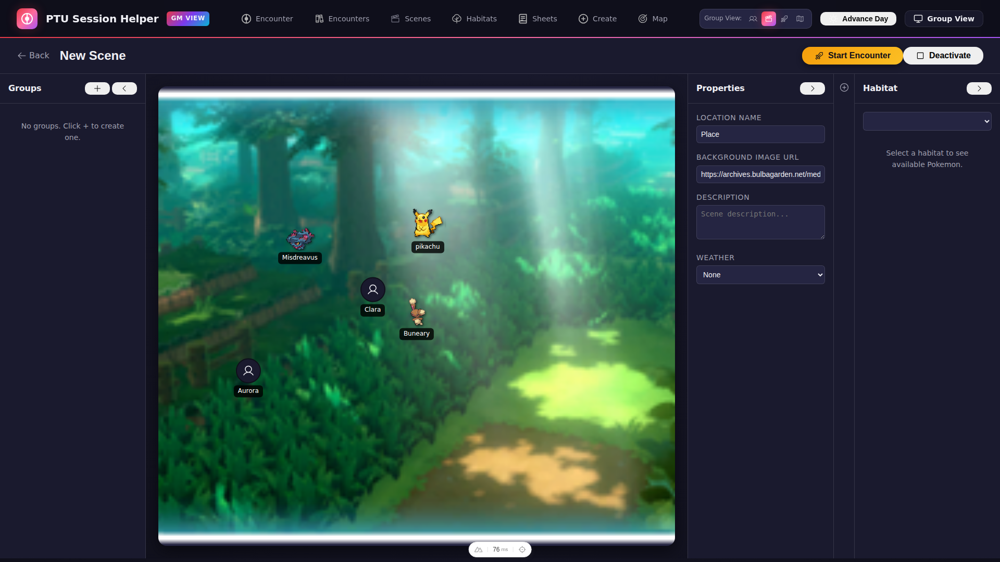
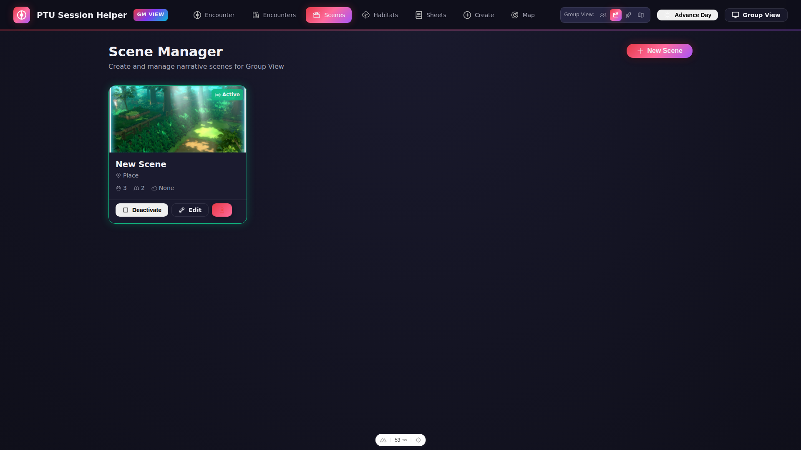
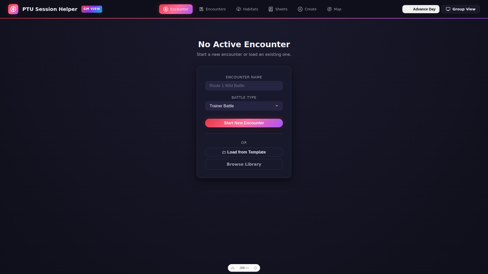
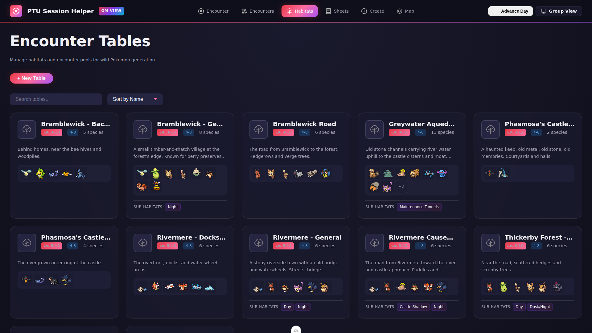
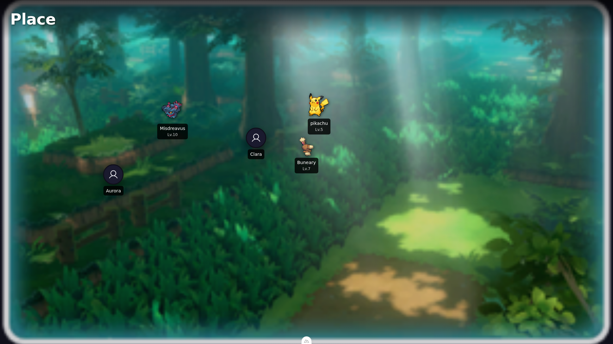

# PTU Session Helper

A Game Master aid application for Pokemon Tabletop United (PTU) 1.05 in-person tabletop RPG sessions. Designed for dual-display use with a GM laptop and a player-facing TV.

## Features

### Core
- **Dual-View System**: GM View with full control, Group View for player-facing TV display
- **Real-time Sync**: WebSocket-based synchronization between GM and Group views
- **Undo/Redo**: Full history support for combat actions (Ctrl+Z / Ctrl+Shift+Z)
- **4K TV Support**: Optimized styling for large displays

### Scene Management
- **Scene Editor**: Drag-drop canvas for positioning Pokemon sprites and character tokens
- **5-Zone Layout**: Collapsible panels (Groups | Canvas | Properties | Add to Scene | Habitat)
- **Scene Manager**: Create, edit, delete, and activate scenes from the GM view
- **Group Scene Display**: Full-screen scene view with background images and weather effects
- **Habitat Integration**: Browse encounter tables, generate random Pokemon from habitat data
- **Scene-to-Encounter**: Convert a scene directly into a combat encounter

### Group View Tab System
- **Tab Router**: GM-controlled tabs for the group display (Lobby, Map, Encounter, Scene)
- **WebSocket Sync**: Tab changes and scene updates push to group view in real-time
- **Cross-Tab Sync**: BroadcastChannel keeps multiple GM tabs in sync

### Encounter Management
- **Three-sided Combat**: Players, Allies, and Enemies with initiative tracking
- **Encounter Templates**: Save and load encounter setups
- **Encounter Tables**: Random encounter generation by habitat
- **Serve to Group**: Push encounters to the Group View TV display

### Combat Tracking
- HP with temporary HP support
- Status conditions (all PTU afflictions)
- Combat stages (+/-6 for each stat)
- Injuries and massive damage
- Trainer vs Full Contact battle modes

### Map & Grid
- **Fog of War**: Hide/reveal areas for players
- **Terrain System**: Mark terrain types on the grid
- **Movement Tracking**: Grid-based positioning

### Library Management
- **Character Library**: Create and manage Human characters and Pokemon
- **CSV Import**: Bulk import characters
- **Pokemon Linking**: Link Pokemon to their trainers

## Tech Stack

- **Framework**: Nuxt 3 (Vue 3) with TypeScript, SPA mode
- **Backend**: Nitro server with 100+ REST API endpoints
- **Database**: SQLite with Prisma ORM
- **State**: Pinia (12 stores)
- **Real-time**: WebSocket via CrossWS
- **Styling**: SCSS with Pokemon Scarlet/Violet dark theme

## Screenshots

### GM View - Scene Editor

*5-zone scene editor with drag-drop canvas, collapsible panels for groups, properties, add-to-scene, and habitat*

### GM View - Scene Editor (Habitat Panel)

*Habitat panel expanded showing encounter table browser*

### GM View - Scene Manager

*Create, edit, and activate scenes for the group display*

### GM View - Encounter Management

*Main encounter interface where the GM manages combat*

### GM View - Character Library

*Character and Pokemon library management*

### GM View - Encounter Tables

*Random encounter table configuration*

### GM View - Habitats

*Habitat-based encounter generation with Pokemon type distributions*

### Group View - Scene Display

*Scene displayed on TV/projector with positioned sprites and background*

### Group View - Encounter Display

*Encounter display shown to players during combat*

## Setup

### Prerequisites

- Node.js 18+
- npm or pnpm

### Installation

```bash
cd app
npm install
```

### Database Setup

```bash
npx prisma db push
npx prisma db seed
```

This creates the database and seeds it with all PTU 1.05 moves from the included CSV data.

### Development

```bash
npm run dev
```

The app will be available at:
- GM View: `http://localhost:3000/gm`
- Group View: `http://localhost:3000/group`

### Production Build

```bash
npm run build
node .output/server/index.mjs
```

## Usage

### GM View (`/gm`)

The GM has full control over encounters:
- Create and manage encounters
- Add/remove combatants from the library
- Apply damage, healing, status conditions
- Manage combat stages
- Advance turns and rounds
- Serve encounters to the Group View
- Undo/redo any combat action

### Group View (`/group`)

TV/projector display for players with GM-controlled tabs:
- **Scene Tab**: Full-screen scene with positioned sprites, background image, and weather effects
- **Encounter Tab**: Shows current encounter with combatant HP (percentages for enemies), turn indicator
- **Map Tab**: Grid-based map display with fog of war
- **Lobby Tab**: Waiting screen between activities
- Optimized for 4K TV display
- Real-time sync via WebSocket — GM changes appear instantly

### Player View (`/player`) - Future Feature

Individual player interface with clickable actions (not yet implemented).

### Keyboard Shortcuts (GM View)

| Shortcut | Action |
|----------|--------|
| `Ctrl+Z` | Undo last action |
| `Ctrl+Shift+Z` / `Ctrl+Y` | Redo |

## Project Structure

```
app/
├── pages/           # File-based routing (gm/, group/, player/)
├── layouts/         # Role-based layouts (gm, group, player, default)
├── components/      # 70+ auto-imported Vue components by domain
├── composables/     # 20 composables (combat, grid, WebSocket, etc.)
├── stores/          # 13 Pinia stores for state management
├── server/
│   ├── api/         # REST endpoints (characters, pokemon, encounters, etc.)
│   ├── services/    # Business logic (combatant, encounter, entity-update)
│   ├── routes/      # WebSocket handler
│   └── utils/       # Prisma client, shared state
├── types/           # TypeScript type definitions
└── assets/scss/     # Global styles and variables

books/markdown/      # PTU 1.05 rulebooks (reference material)
```

## Game System

This app is built for **Pokemon Tabletop United 1.05**. Reference materials in `books/markdown/` include:
- `core/` - Core rulebook split into 12 chapter files
- `pokedexes/` - Pokemon stats and data (per-Pokemon files in `gen1/`-`gen8/` + `hisui/`)
- `errata-2.md` - Rule corrections

When implementing game mechanics, use `/verify-ptu` to check compliance with PTU 1.05 rules.

## License

Private project for personal use.
